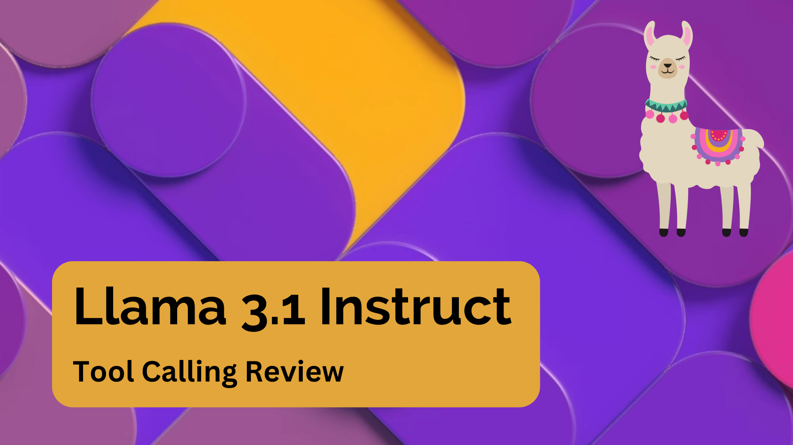

# Llama 3.1 Tools Review

Testing Llama 3.1 tools with llama.cpp and 4-bit Quantized 8B Instruct. This includes:

- Running Meta's example.  
- Check if multiple-tools can be selected from single prompt.  
- Check if LLM is able to use previous tool call response.  
- Check complex JSON extract with tool call.  

## Video walkthrough

[](https://youtu.be/xuzRIWVxb_w)

## Prerequisites

Before you begin, ensure you have met the following requirements:

- You have installed Python 3.9 or later.
- You have installed [Poetry](https://python-poetry.org/docs/#installation).

## Installation

1. Clone the repository:

   ```sh
   git clone https://github.com/AgiFlow/llama31
   cd llama31
   ```

2. Install the dependencies:

   ```sh
   poetry install
   ```

3. Activate the virtual environment:

   ```sh
   poetry shell
   ```
   
4. Download models
This repo uses [lmstudio-community/Meta-Llama-3.1-8B-Instruct-GGUF](https://huggingface.co/lmstudio-community/Meta-Llama-3.1-8B-Instruct-GGUF/tree/main) from lmstudio-community for testing. You can also use other models of your choice.

## Running the Jupyter Notebook

1. Launch Jupyter Notebook:

   ```sh
   poetry run jupyter notebook
   ```

## Contributing

To contribute to this project, please fork the repository and create a pull request. For major changes, please open an issue first to discuss what you would like to change.

## License

This project uses the following license: [MIT License](LICENSE).
